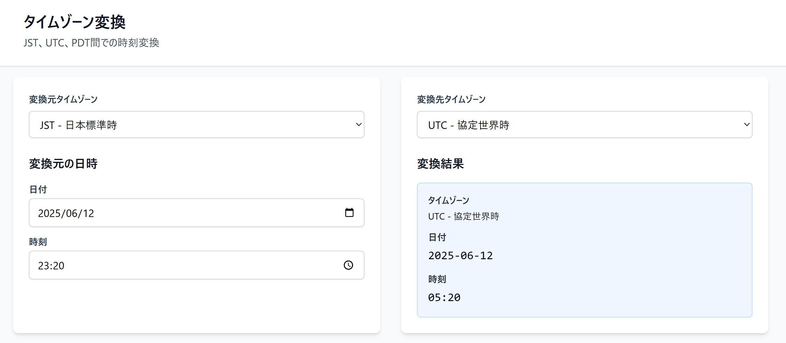

# Timezone Converter

JST、UTC、PDT間での双方向時刻変換を行うWebアプリケーション。

## 概要

パブリッククラウドのコンソールなどで複数のタイムゾーンで出力される通知やログを、ローカルタイムと日付込みで簡単に理解することを目的とした個人用途のアプリケーションです。

## スクリーンショット



## 機能

- **対応タイムゾーン**
  - JST (UTC+9)
  - UTC (UTC+0) 
  - PDT (UTC-7, サマータイム考慮なし)

- **リアルタイム変換**: 日時入力と同時に自動変換
- **レスポンシブデザイン**: PC・スマートフォン対応
- **直感的なUI**: シンプルな左右2画面構成

## 技術仕様

- **Framework**: Next.js 15.3.3
- **Runtime**: React 19.1.0
- **Language**: TypeScript
- **Styling**: TailwindCSS 3.4.17
- **Build Tool**: Turbopack (Next.js内蔵)

## セットアップ

### 前提条件

- Node.js 18.0.0以上

### インストール

```bash
# リポジトリをクローン
git clone https://github.com/namusour0763/next-timezone-converter.git

# プロジェクトディレクトリに移動
cd next-timezone-converter

# 依存関係をインストール
npm install
```

### 開発

```bash
# 開発サーバーを起動
npm run dev
```

ブラウザで [http://localhost:3000](http://localhost:3000) を開きます。

### ビルド

```bash
# 本番用ビルド
npm run build

# 本番サーバーを起動
npm start
```

### その他のコマンド

```bash
# リンティング
npm run lint

# 型チェック
npm run type-check
```

## プロジェクト構成

```text
src/
├── app/
│   ├── globals.css          # グローバルスタイル
│   ├── layout.tsx           # ルートレイアウト
│   └── page.tsx             # メインページ
├── components/
│   ├── ConversionResult.tsx # 変換結果表示
│   ├── DateTimeInput.tsx    # 日時入力
│   └── TimezoneSelect.tsx   # タイムゾーン選択
└── lib/
    ├── context.tsx          # 状態管理（Context API）
    └── timezone.ts          # タイムゾーン変換ロジック
```

## 設計方針

- **軽量**: 過剰なライブラリを避けたミニマル構成
- **クライアント完結**: APIルート不要、全ての変換処理をクライアントサイドで実行
- **永続化なし**: セッション内のみでの利用（データベース不要）
- **TypeScript**: 型安全性を重視
